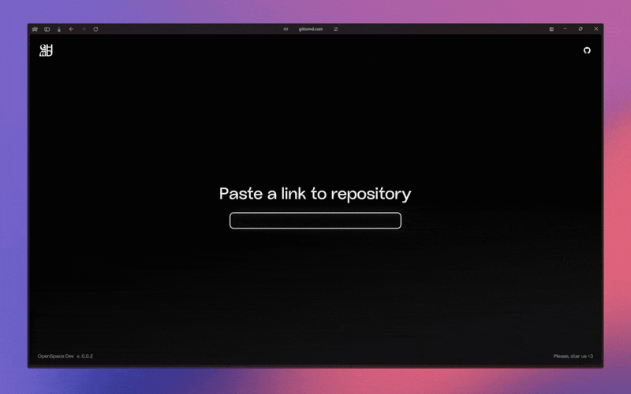

<div align="center">
  <picture>
    <source media="(prefers-color-scheme: dark)" srcset="./public/icons/logo_black.png">
    <source media="(prefers-color-scheme: light)" srcset="./public/icons/logo_white.png">
    
  </picture>
  <h1>gittomd</h1>
  <p><strong>Your entire GitHub repo, intelligently packaged into a single Markdown file.</strong></p>
  <p>The perfect tool for feeding codebases to LLMs, creating documentation, or for offline code analysis.</p>
</div>

<div align="center">

[](https://app.netlify.com/projects/gittomd/deploys)
[](https://opensource.org/licenses/MIT)
[](https://github.com/OpenSpace-Dev/gittomd/issues)
[](https://github.com/OpenSpace-Dev/gittomd/stargazers)

<a href="https://www.producthunt.com/products/gittomd?embed=true&utm_source=badge-featured&utm_medium=badge&utm_source=badge-gittomd" target="_blank"></a>
</div>

---

### ✨ Key Features

*   **LLM-Optimized Formatting:** Outputs clean Markdown with language-annotated code blocks (`\`\`\`typescript:src/app/page.tsx`), a format that models understand perfectly.
*   **Intelligent Filtering:** Automatically ignores binary files and common clutter (`.git`, `node_modules`, `dist/`, etc.) to keep your context clean.
*   **Blazing Fast & Cached:** Leverages a global edge network and Redis caching to deliver results quickly, even for large repositories.
*   **Simple & Free:** No sign-up required. Just paste a URL and go.


## 🛠️ How to Use



Using `gittomd` is as simple as it gets.

1.  **Visit [gittomd.com](https://gittomd.com)**
2.  **Paste** a GitHub repository URL.
3.  **Click Generate** and copy the Markdown to your clipboard!

Alternatively, you can access the content directly via URL:

```
https://gittomd.com/<github-user>/<github-repo>
```

For example, to get the Markdown for the `expressjs/express` repository:
[https://gittomd.com/expressjs/express](https://gittomd.com/expressjs/express)

## 💻 Tech Stack

This project is built with a modern, performant, and scalable stack:

*   **Framework:** [Next.js](https://nextjs.org/) 15 (App Router & Turbopack)
*   **Styling:** [Tailwind CSS](https://tailwindcss.com/) v4
*   **Caching:** [Upstash Redis](https://upstash.com/)
*   **GitHub API:** [Octokit](https://github.com/octokit/octokit.js)

## 🤝 Contributing & Running Locally

We welcome contributions of all kinds! Whether it's reporting a bug, suggesting a feature, or submitting a pull request, your help is appreciated.

### Setup Instructions

1.  **Fork & Clone:**
    ```bash
    git clone https://github.com/OpenSpace-Dev/gittomd.git
    cd gittomd
    ```

2.  **Install Dependencies:**
    ```bash
    npm install
    ```

3.  **Set Up Environment Variables:**
    Create a `.env.local` file by copying the example file:
    ```bash
    cp .env.example .env.local
    ```
    You will need to fill in the following values:
    *   **GitHub App Credentials:** Create a [GitHub App](https://docs.github.com/en/apps/creating-github-apps/creating-a-github-app) with `Read-only` permissions for `Contents`. This is the best way to handle API rate limits.
    *   **Upstash Redis Credentials:** Create a free database on [Upstash](https://upstash.com/) for caching.

4.  **Run the Development Server:**
    ```bash
    npm run dev
    ```

The app will be available at `http://localhost:3000`.

## ❤️ Show Your Support

If you find `gittomd` useful, please give it a ⭐️ on GitHub! It helps the project gain visibility and encourages further development.

---

<div align="center">
  <p>A project by <a href="https://t.me/openspaceteam">OpenSpace Dev</a></p>
</div>